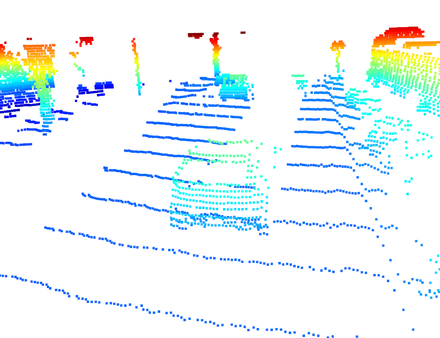
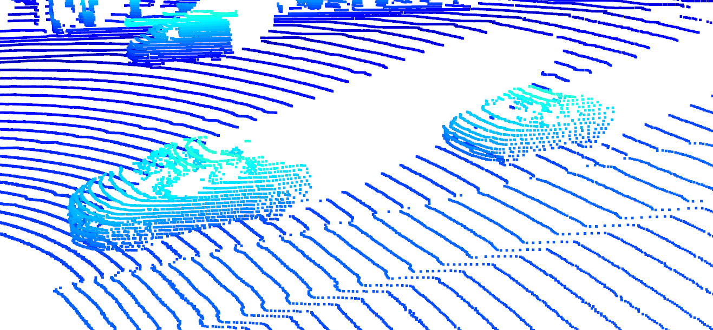
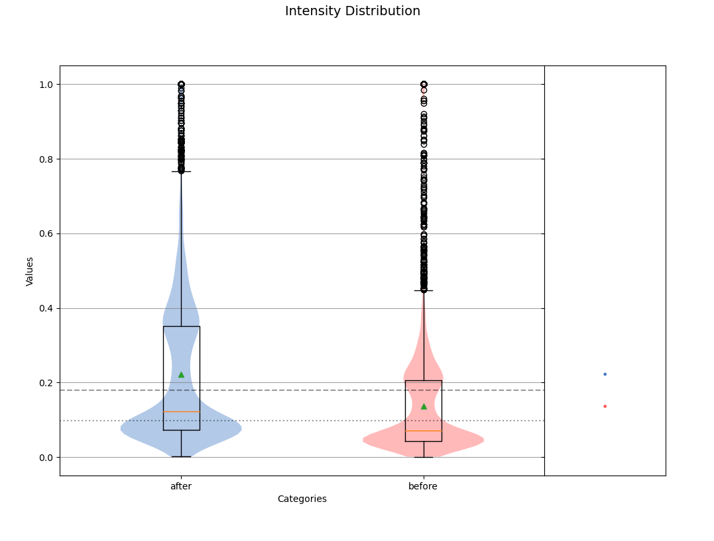

Make sure to have zlib
sudo apt-get install zlib1g-dev

# Writeup: Track 3D-Objects Over Time

Please use this starter template to answer the following questions:

Visualizing point-cloud:
    Depending on where vehicles are located in relation to the lidar scanner, they will be visible in different ways, for example in Figure 1, the closest vehicle is being cut off by the Waymo vehicle conducting the scan. The vehicle right beind the obstructed one is very visible and is represented with a massive amount of lidar points. The sedan and pickup truck behind the obstructed vehicle are slightly obstructed. 
    

Figure 1: close car getting cut off

In Figure 2, the pickup and its trailer are very visible and well defiend by the point cloud. 

Figure 2: pickup and trailer

In Figure 3, I found some vehicles far from the Waymo scanning vehicle. The car to the bottom right is unobstructed, however all other vehicles in the image are very hard to recognize. This is partly due to the bottom right car obstructing the scan and partly due to the distance away from the scanner they are located.

Figure 3: vehicles far from scanner

The front vehicle in Figure 4 is obstructing most of the lidar scan points from the vehicle behind it. On the top right there are only a few lidar points on the far car.

Figure 4: close car cuts off far car

The two vehicles in the foreground of Figure 5 are very well defined by the lidar scan and contain dense and detailed point cloud points.

Figure 5: close car cuts off far car

In addition, for step ID_S2_EX2, I scaled the intensity values to 3 standard deviations. The results can be seen in the distribution in Figure 6. Before the scaling, the mean and standard deviation of the intensity values were 0.1361 and 0.1493 respectively. After, they were 0.2222 and 0.2036 respectively

Figure 6: bev intensity distributions
