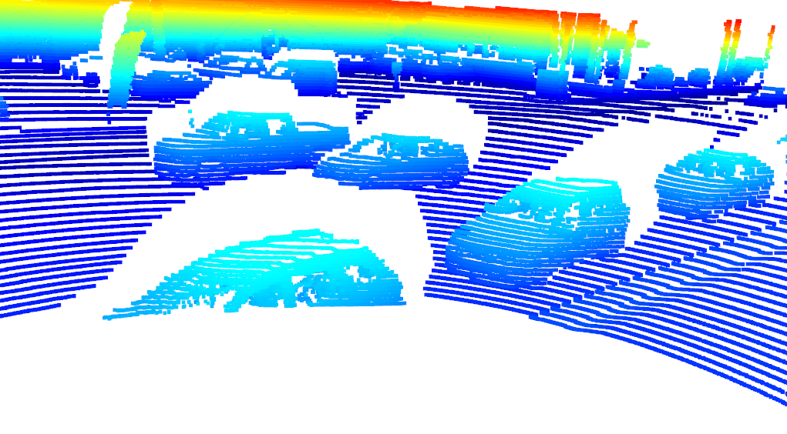
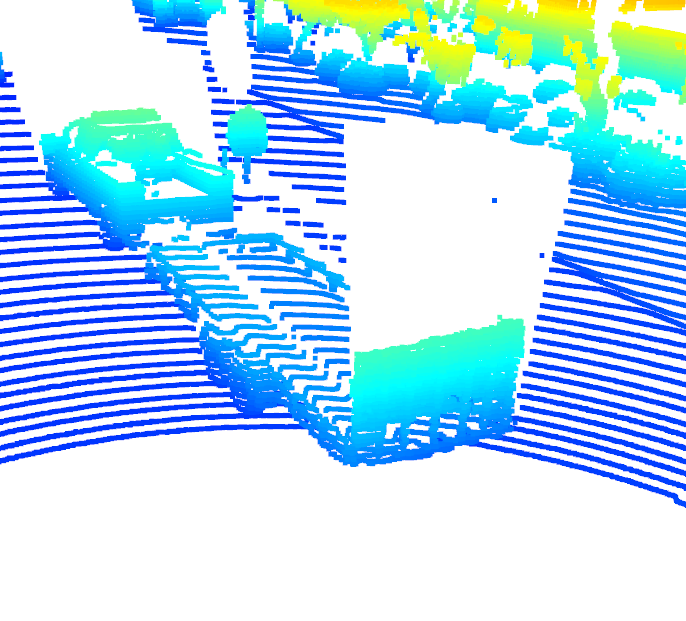
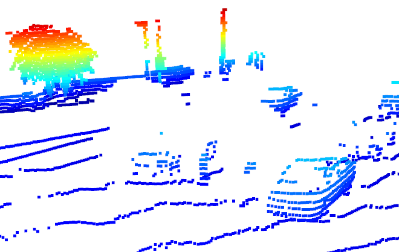

Make sure to have zlib
sudo apt-get install zlib1g-dev

# Writeup: Track 3D-Objects Over Time

Please use this starter template to answer the following questions:

Visualizing point-cloud:
    Depending on where vehciles are located in relation to the lidar scanner, they will be visible in different ways, for example in Figure 1, the closest vehicle is being cut off by the Waymo vehicle conducting the scan. The vehicle right beind the obstructed one is very visible and is represented with a massive amount of lidar points. The sedan and pickup truck behind the obstructed vehicle are slightly obstructed. In Figure 2, the pickup and its trailer are very visible and well defiend by the point cloud. In Figure 3, I found some vehicles far from the Waymo scanning vehicle. The car to the bottom right is unobstructed, however all other vehicles in the image are very hard to recognize. This is partly due to the bottom right car obstructing the scan and partly due to the distance away from the scanner they are located. 4
    

### 1. Write a short recap of the four tracking steps and what you implemented there (filter, track management, association, camera fusion). Which results did you achieve? Which part of the project was most difficult for you to complete, and why?

### 2. Do you see any benefits in camera-lidar fusion compared to lidar-only tracking (in theory and in your concrete results)? 

### 3. Which challenges will a sensor fusion system face in real-life scenarios? Did you see any of these challenges in the project?

### 4. Can you think of ways to improve your tracking results in the future?

