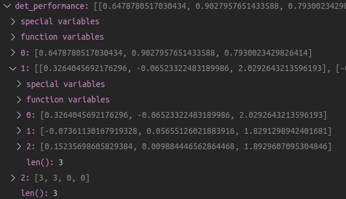

# Writeup: 3D Object Detection project (Part 1)

## Section 1 : Compute Lidar Point-Cloud from Range Image

### Visualize range image channels (ID_S1_EX1)

Lidar scans are stored as range images. The point of this step of the project is to extract the range images and visualize the two channels, range and intensity. The results are as follows.

Range Image

### Visualize lidar point-cloud (ID_S1_EX2)

In this step, the point-cloud generated from the given pcl_from_range_image function was visualized. Vehicles with various degrees of visibility can be seen in these images. 

Depending on where vehicles are located in relation to the lidar scanner, they will be visible in different ways, for example in Figure 1, the closest vehicle is being cut off by the Waymo vehicle conducting the scan. The vehicle right beind the obstructed one is very visible and is represented with a massive amount of lidar points. The sedan and pickup truck behind the obstructed vehicle are slightly obstructed. 
    

Figure 1: close car getting cut off

In Figure 2, the pickup and its trailer are very visible and well defiend by the point cloud. 

Figure 2: pickup and trailer

The following figure continas intensity information from Figures 1 and 2. On the left, we can see the top of the vehicle next to the Waymo vehicle, and the two behind it. We can also see the truck with the trailer from Figure 2. It is important to note that the areas of high intensity are any type of light, licence plates, and other metalic objects. 

Figure 1 and 2 intensity view

In Figure 3, I found some vehicles far from the Waymo scanning vehicle. The car to the bottom right is unobstructed, however all other vehicles in the image are very hard to recognize. This is partly due to the bottom right car obstructing the scan and partly due to the distance away from the scanner they are located.

Figure 3: vehicles far from scanner

The front vehicle in Figure 4 is obstructing most of the lidar scan points from the vehicle behind it. On the top right there are only a few lidar points on the far car. This can also be seen in the intensity view of the same scenario.

Figure 4: close car cuts off far car

Figure 4 intensity

The two vehicles in the foreground of Figure 5 are very well defined by the lidar scan and contain dense and detailed point cloud points.

Figure 5: close car cuts off far car

In addition, for step ID_S2_EX2, I scaled the intensity values to 3 standard deviations. The results can be seen in the distribution in Figure 6. Before the scaling, the mean and standard deviation of the intensity values were 0.1361 and 0.1493 respectively. After, they were 0.2222 and 0.2036 respectively

## Section 2 : Create Birds-Eye View from Lidar PCL
### Convert sensor coordinates to BEV-map coordinates (ID_S2_EX1)

Perform the first step in converting the lidar point cloud to BEV perspective.

Sensor coordinates to BEV map coordinates

### Compute intensity layer of the BEV map (ID_S2_EX2)

Rearrange values from the first part then filter out all non unique points. Then assign the highest of these points to the x and y in the intensity map.

To limit high intensity, the values, before being assigned into the intensity map, were normalized. The mean and standard deviation from training_segment-100508... frame 0 was calculated to be 0.1361 and 0.1493 respectively. I chose normalize the values within 3 standard deviations from the mean. The resulting images show the results of this normalization. It can be seen that the high intensity values are actually over saturated. I have played around with other normalization techniques, but still got similar results. Some high values are rounded to 255. I plan on experimenting with different techniques to scale the values non linearly to attempt to get rid of the outliers. 

In the zoomed in image, the method I used to group the point cloud points into the intensity map differed slightly from the instruction image. The gap in between the front bumber of the vehicle and windshield is a lot smaller in my image.

The resulting distribution can be seen in Figure 6 and does increase the main distribution while reducing the span of outliers. The mean and standard deviation after scaling by 3 standard deviations are 0.2222 and 0.2036 respectively.

Intensity map normalized

Intensity map normalized zoomed

Figure 6: bev intensity distributions

### Compute height layer of the BEV map (ID_S2_EX3)

Using the lidar_pcl_top pruned point cloud from ID_S2_EX2, the height values can be mapped to the height map easily. The results are below.

Height map

Height map zoomed

## Section 3 : Model-based Object Detection in BEV Image

### Add a second model from a GitHub repo (ID_S3_EX1)

In this step I was able to familiarize myself with the SFA3D code used to create a fpn resnet yolo network. This was done in a few steps.

#### Loading configs 

The SFA3D code includes configurations such as number of layers, batch size and confidence threshold to name a few.

#### Create model

Some convience functions provided implemented code from SFA3D such as the fpn_resnet class, and can return a pretrained model.

#### Predict objects from image

The most difficult part of this step for me was to collect images from the output of the network. Some provided functions were used to parse through the different outputs of the network resulting in a detection array. By default, the detection array has 3 arrays, one for each class. The instructions reccommend ignoring all others and only focus on vehicles, however I injected code to account for other classes. This way, if I decide to use code from this project in the future, I will be able to adapt to any class with minimal code changes. Each of the class arrays contians all the detections for that class in the form [class, x, y, z, h, w, l, yaw]. My detections were similar to the inscruction detections and can be seen below. Note that because I changed the code, my detections still contain the other classes detections as well. This can be seen in the second image.

Detections

All class detections

#### Convert from BEV coordinate space to metric coordinates in vehicle space

Using configs containing x y and z ranges, the detections were converted to the vehicle space, then visualized. The result is identical to the instructions.

Vehicle space BEV object detections

## Section 4 : Performance Evaluation for Object Detection

Dispite objects being detected in the BEV space, we are not done! It is important to evaluate the affectiveness of the model. 

### Compute intersection-over-union between labels and detections (ID_S4_EX1)

The computatin of iou between labels and detections is actually not an efficient process. Every detection must be compared to every label. Only ious over the threshold will be counted as a positive prediction. The actual process requires the x and y position, length and width, and yaw to be converted into points corrisponding to each corner of the 2d rectangle in the BEV space. The list of corners is then converted into a shapely geometry polygon. This python library has helpful functions to calculate the intersection and union between two polygons which is exactly what is needed to calculate iou. 

My code produces 3 ious that are different than the instruction's. I believe that if I change the threshold from 0.5 to 0.7 I will produce only 2 ious. This can be seen below.

Ious

Center distances between prediction and ground truth.

### Compute false-negatives and false-positives (ID_S4_EX2)

The true positives, false negatives, and false positives for this frame are also calculated here.

False negatives and false positives

### Compute precision and recall (ID_S4_EX3)

The previous results from frame 0 can be combined with many more frames to calculate precision and recall. The performance metrics were calculated here. In addition, I tested the metrics with use_labels_as_objects set to true to test if my results were plausible. This test confirmed that I my results were reasonable.

Performance metrics

Plausibility test
