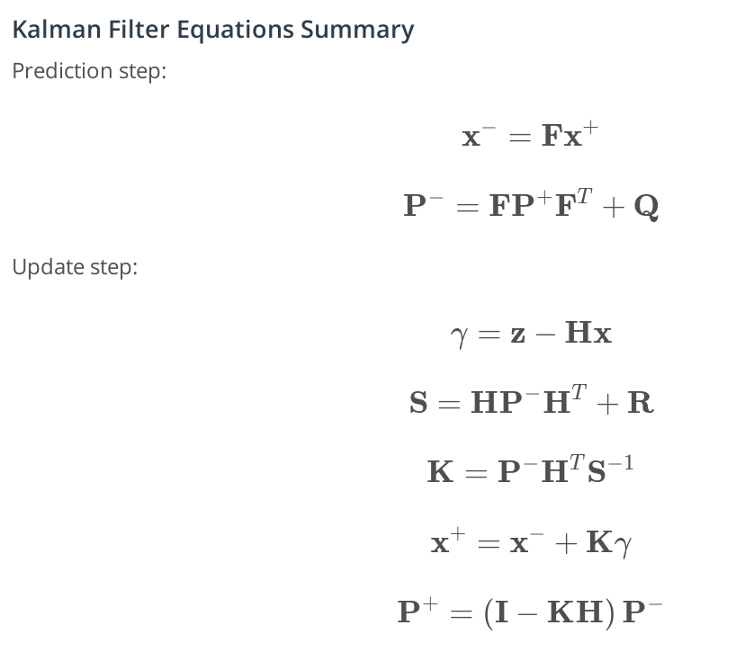
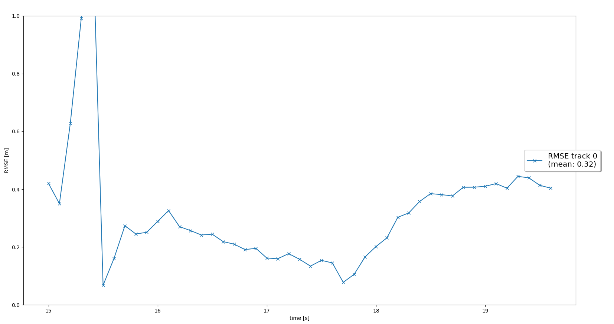
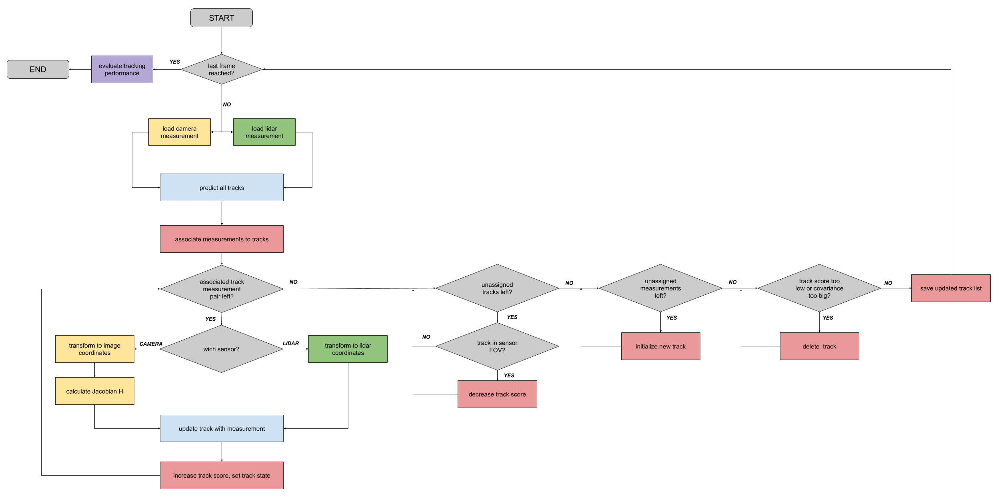
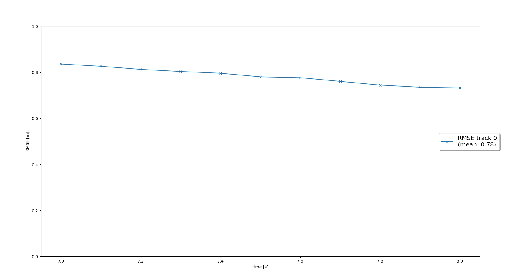
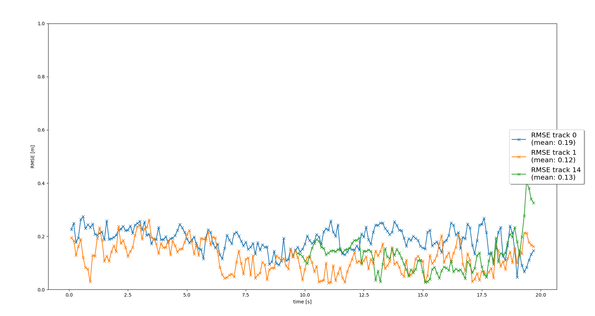

# Writeup: Sensor fusion and object detection (Part 2)
## 1. Write a short recap of the four tracking steps and what you implemented there (filter, track management, association, camera fusion). Which results did you achieve? Which part of the project was most difficult for you to complete, and why?

### Filter
In the filter step, the prediction from the most recent measurement will be calculated. This prediction is compared to the next measurement using an Extended Kalman Filter and the result updates the track. 

The prediction step follows the formula in the following image. The matrix F is the state transformation matrix and transforms data points from sensor space to measurement space. To caluclate the estimation error covariance matrix P, the process noise covariance Q is needed. The Q in the exercises was only a 2x2 matrix, however Q is a 6x6 matrix for this project as we are using the x, y and z positions and their corrisponding velocities. 

To update the track, the residual gamma must be calculated. The gamma compares the new measurement, z with the state estimation. The gamma is used to calculate the updated x value along with the Kalman gain K and the covariance S.

Predict and Update  

After implementing the predict and update functions for lidar only in a 3 dimentional space, the result is a mean RMSE error of 0.32. The error in the following image begins high, but reduces rapidly as the kalman filter is able to gather more information.

Tracking result

### Track management

The track management part of the project is conducted on a scenario where only one vehicle is entering and exiting the frame. The first step was replacing the hard coded x and P values with the updated values from the measurement. This part is different from the exercises as 3 dimentions are being considered instead of only 2. The track is then given a score and listed as initialized. 

Next, inside the manage_track function, a list of indexes to tracks from the tracks list which are unassigned are passed in. All tracks in the track lists that are indexed by the unassigned tracks list, will have their score reduced in this step. Old tracks that have left the area and whose scores are below a threshold will be deleted. Each track's score will be increased if the measurement is in frame and if the score surpasses a threshold, and it's state can be updated to tentitive or confirmed. This process is illistrated in the following flow diagram. 

Multi target tracking flow

In the following gif, you can see that as the vehicle enters the threshold, it is labeled as initialized on the first frame and boxed in red. On the next frame, it become tentitive and is boxed in yellow for a few frames until it surpases the threshold and is marked confirmed and boxed in green. It is important to note that the score is not reduced after it exits the field of view because that logic will be implemented in a later step. In addition, the boxes are slightly offset from the vehicle. This is caused by a y-offset from the lidar detections as explained in the instructions. Also "If the input has a systematic offset, the Kalman filter cannot compensate it because we assume zero-mean data. It is part of the real-world challenges that our assumptions about the data are not always met. We can, however, compensate this offset through sensor fusion once we include other sensors" which will be completed in a further step. 

Single target management

Single target management RMSE

### Association

The first part of the association step is to create a nearest neighbor association matrix of Mahalanobis distances between each track and each measurement. A gating fucntion implementing a chi-square-distribution is also implimented to ensure that a track prediction is close to the measurement. 

In the next step, the get_closest_track_and_meas function is implemented which finds the minimum value and removes its corrisponding row and column from the association matrix and from their unassigned list.

In the resulting gif, the two vehicles consistantly within the threshold are are confirmed for most of the video. There are several ghost tracks, however they never become confirmed and are soon deleted. About half way through the gif, the third vehicle appears from the left side and is marked confirmed for the remainder of the scene.

Multi target association

Multi target RMSE

### Camera Fusion

The final step of the Sensor Fusion project is to add Camera fusion. This is important because more data is better when it comes to Kalman filters as the camera and lidar measurements can improve the confidince of the update.

To add the camera, the in_fov function will be implemented. When the sensor is initialized, the fov range will be applied depending on the type of sensor. The input x value is then converted from vehicle (global) coordinates to the sensor space. 

Next, hx must be implemented for camera. The prediction x will first be converted from vehicle (global) coordinates to the sensor space. The x that is now in sensor space will be projected from the 3D sensor space to the 2D camera space where x and y corrispond to the x and y pixel of the image in the center of the vehicle. 

Compared to the lidar only, the camera and lidar sensor fusion greatly reduced the RMSE of the 3rd vehicle while slightly increasing one of the first two.

Multi vehicle tracking with camera and lidar video

Multi vehicle tracking with camera and lidar RMSE

### Reflection

The most difficult part of the project was undersanding the difference between h(x) and H. I was aware that H should only be used for linear equasions such as lidar, however, there is logic in both get_hx and get_H to return different matrices for differing sensor types. Eventually I was able to figure out that hx replaces the dot product calculation H * x to find gamma. 

So for linear lidar: z(3x1) - (H(3x3) * x(3x1))(3x1)

and for non-linear camera: z(3x1) - f(x)(3x1)

In addition, the conversions and transformations between coordinate spaces was difficult to follow and understand. Although it was clearly explained, it took some time for me to realize that calculations including z to find gamma, needed to be done in the measurement coordinate space. The other steps to find K in the update function was basically a transformation of gamma back to vehicle coordinates so it could be added to x.

---
## 2. Do you see any benefits in camera-lidar fusion compared to lidar-only tracking (in theory and in your concrete results)? 

In theory, Kalman filters will be able to update tracks more accuratly when more sensors provide measurements. This is exactly what is seen after the addition of the camera. During the track management part of the project, it was noted that the lidar measurements had a y offset which was compensated after implementing camera measurements. You can see this in the Multi vehicle tracking with camera and lidar video above, where the bounding boxes cover the vehicles more accurately. In addition, tracks are confirmed faster and more accuratley.

## 3. Which challenges will a sensor fusion system face in real-life scenarios? Did you see any of these challenges in the project?

A sensor fusion system will face challenges such as incorreclty calibrated sensors, ghost tracks, and vehicles, pedestrians and cyclists moving in unexpected ways. A few challenges were seen in the project including ghost tracks which were caused from both the camera sensor and the lidar sensor models producing false positives. In addition, the y offset from the lidar scanner occured.

## 4. Can you think of ways to improve your tracking results in the future?

Tracking results can be improved by implementing a more advanced data association method. Fine-tuning parameters such as normalizing lidar intensity values in the birds-eye-view space by standard deviation can also improve tracking results. 